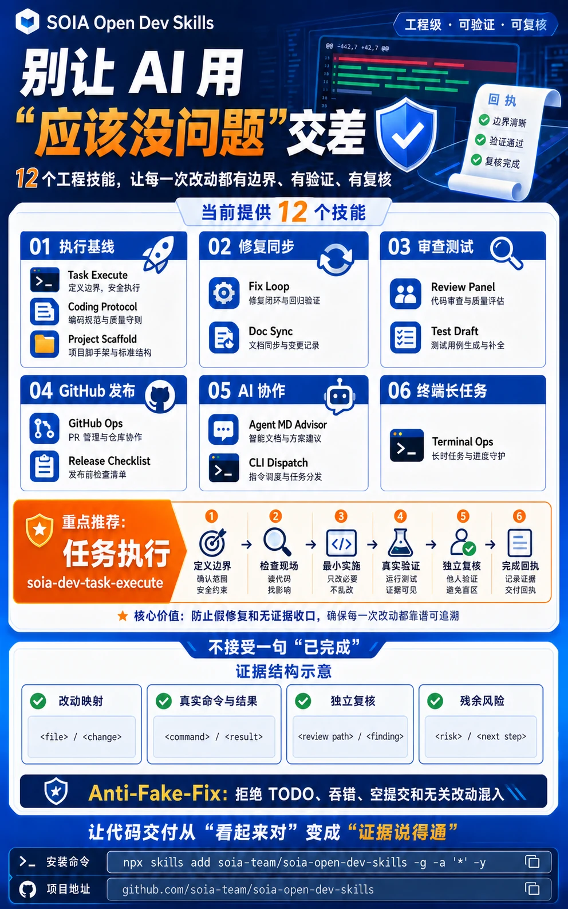
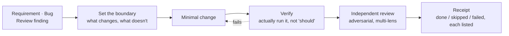

<div align="center">



# SOIA Open Dev Skills

**Stop letting the agent close a change with "should be fine"**

12 skills that weld scope, verification and review into the flow: define the boundary first, produce evidence after

[中文](README.md) · English · [Ecosystem portal](https://github.com/soia-team/soia-open-skills)

</div>

---

## What it solves

The most misleading state in AI-assisted coding: **the command ran, a conclusion was written, and nobody verified anything.** What's missing is not a smarter model — it's a flow that does not let steps be skipped.



## 12 skills

### 01 Change loop　`Requirement or bug → a change with scope, verification and review`

| Skill | Responsibility | Ready |
|---|---|:-:|
| `soia-dev-task-execute` | General engineering loop: define boundary, minimal change, verify, independent review, receipt | ✅ |
| `soia-dev-coding-protocol` | Establishes minimal-scope, verify-first, anti-fake-fix and post-write review contracts | ✅ |
| `soia-dev-fix-loop` | Five steps for review or test findings: reproduce, decide, fix, regress, receipt | ✅ |
| `soia-dev-review-panel` | Adversarial multi-lens review of a diff or skill package — read-only, never edits, merges or publishes | ✅ |

### 02 Testing and release　`Requirement or change → test plan, release checklist, rollout gates`

| Skill | Responsibility | Ready |
|---|---|:-:|
| `soia-dev-test-draft-doc` | Generates test plans, cases and an acceptance matrix from requirements, PRDs or change notes | ✅ |
| `soia-dev-release-plan-checklist` | Generates the release checklist, pre-flight gates, canary verification and post-release checks | ✅ |

### 03 Repository operations　`Repo as-is → consistent docs, compliant PRs, a working baseline`

| Skill | Responsibility | Ready |
|---|---|:-:|
| `soia-dev-github-ops` | GitHub `gh` CLI operations, PR compliance review and remediation | 🟡 |
| `soia-dev-doc-sync` | Audits and repairs factual drift between docs, README, CHANGELOG, VERSION and the source of truth | ✅ |
| `soia-dev-project-scaffold` | Generates a minimal AI-collaboration baseline for a new Git project (AGENTS.md + docs nav) | ✅ |

### 04 Terminal and multi-agent　`Long tasks and several CLIs → controlled execution and dispatch`

| Skill | Responsibility | Ready |
|---|---|:-:|
| `soia-dev-terminal-ops` | Long tasks, tmux sessions, log capture, stall diagnosis; killing goes through TERM → recheck → KILL | ✅ |
| `soia-dev-agent-cli-dispatch` | External AI CLI dispatch and model routing, with controlled hand-off and usage receipts | 🟡 |
| `soia-dev-agent-md-advisor` | Advisor for AI project instructions and config: diagnosis, drafting and rewriting | ✅ |

✅ Works right after install　🟡 Needs a login or API key first; the skill tells you what is missing before it runs

## Install

Any of three hosts. Installing the domain plugin brings all 12 skills at once.

```bash
claude plugin marketplace add soia-team/soia-open-skills && claude plugin install soia-dev@soia
```

```bash
codex plugin marketplace add soia-team/soia-open-skills && codex plugin add soia-dev@soia
```

WorkBuddy is a desktop app with no CLI, so a skill does the work — tell your agent "install into WorkBuddy", or run:

```bash
python3 <soia-open-skills>/skills/soia-meta-skill-release/scripts/install_workbuddy_experts.py soia-dev
```

Restart the client, then summon **Soia · 研发工程师** under Experts → My Experts.

> **Always-on cost ~971 tok**. `claude plugin disable soia-dev@soia` drops it to zero; enable it again any time.
> For a single skill use npx: `npx skills add soia-team/soia-open-dev-skills -g -a '*' -s <skill-name> -y` — pick one route or the other; running both puts the same skill in the index twice and the copies drift apart.

## What it does not do

- **No fake fixes.** If the shortest path to a green test is editing the assertion or adding a skip, that is not a fix — the skill requires the real cause be stated.
- **No scope creep.** Drive-by refactors and formatting changes get confirmed first.
- **Does not make product decisions.** Trade-offs and priorities are yours to call.
- **Does not touch credentials.** A plaintext key found in the repo gets its location reported, not migrated or deleted.
- **No internal company process.** Industry-specific requirement, test and release standards live in private repos.

## Contributing

Before committing a skill change:

```bash
python3 -m unittest discover -s tests -p 'test_*.py' && python3 scripts/audit_skills.py --strict && python3 scripts/generate_expert_manifest.py --check
```

Full workflow in the portal's [CONTRIBUTING.md](https://github.com/soia-team/soia-open-skills/blob/main/CONTRIBUTING.md).

## License

MIT — see [LICENSE](./LICENSE).
