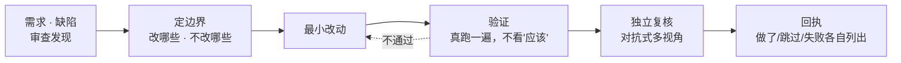

<div align="center">


# SOIA Open Dev Skills

**让 AI 改代码，不再「应该没问题」就交差**

12 个技能把边界、验证与复核焊进流程；先划范围，改完必须拿出证据

[English](README.en.md) · 中文 · [全生态门户](https://github.com/soia-team/soia-open-skills)

</div>

---

## 它解决什么

AI 编码最会骗人的状态：**命令跑通了，结论也写了，但没人验证过**。缺的不是更聪明的模型，是一条不许跳步的流程。



## 12 个技能

### 01 改动闭环　`需求或缺陷 → 有边界、有验证、有复核的改动`

| 技能 | 职责 | 开箱 |
|---|---|:-:|
| `soia-dev-task-execute` | 通用工程任务闭环：定边界、最小改动、验证、独立复核、回执 | ✅ |
| `soia-dev-coding-protocol` | 为普通代码改动建立最小范围、验证前置、anti-fake-fix 与写后复核契约 | ✅ |
| `soia-dev-fix-loop` | 五步处理审查或测试发现：复现、决策、修复、回归复核、回执 | ✅ |
| `soia-dev-review-panel` | 从多视角对 diff 或技能包做对抗式复核，只读不改、不合并、不发布 | ✅ |

### 02 测试与发版　`需求或变更 → 测试计划、发布清单与灰度门`

| 技能 | 职责 | 开箱 |
|---|---|:-:|
| `soia-dev-test-draft-doc` | 从需求、PRD 或变更说明生成测试计划、用例与验收对照 | ✅ |
| `soia-dev-release-plan-checklist` | 生成发布清单、预检门、灰度验证与发布后核对 | ✅ |

### 03 仓库运维　`仓库现状 → 一致的文档、合规的 PR、可用的基线`

| 技能 | 职责 | 开箱 |
|---|---|:-:|
| `soia-dev-github-ops` | GitHub `gh` CLI 运维、PR 合规审查与修复 | 🟡 |
| `soia-dev-doc-sync` | 审计并修复 docs、README、CHANGELOG、VERSION 与真源之间的事实漂移 | ✅ |
| `soia-dev-project-scaffold` | 为新 Git 项目生成最小 AI 协作基线（AGENTS.md + docs 导航） | ✅ |

### 04 终端与 AI 协作　`长任务与多 AI → 可控的执行与派发`

| 技能 | 职责 | 开箱 |
|---|---|:-:|
| `soia-dev-terminal-ops` | 长任务、tmux 会话、日志抓取、停滞诊断；杀进程走 TERM→复查→KILL 确认门 | ✅ |
| `soia-dev-agent-cli-dispatch` | 外部 AI CLI 调度与模型路由，受控派活与用量回执 | 🟡 |
| `soia-dev-agent-md-advisor` | AI 项目指令与配置设计顾问：诊断、起草与改写建议 | ✅ |

✅ 装完即用　🟡 需先完成登录或申请 API key，技能会在执行前告诉你缺什么

## 安装

三个宿主任选，装整个领域插件即 12 个技能一次到位。

```bash
claude plugin marketplace add soia-team/soia-open-skills && claude plugin install soia-dev@soia
```

```bash
codex plugin marketplace add soia-team/soia-open-skills && codex plugin add soia-dev@soia
```

WorkBuddy 是桌面端没有 CLI，由技能代劳——对 AI 说「装到 WorkBuddy」，或直接跑：

```bash
python3 <soia-open-skills>/skills/soia-meta-skill-release/scripts/install_workbuddy_experts.py soia-dev
```

装完重启客户端，在【专家中心 → 我的专家】召唤 **Soia · 研发工程师**。

> **常驻成本 ~971 tok**。不用时 `claude plugin disable soia-dev@soia` 降到零，随时开回来。
> 只想要单个技能可走 npx：`npx skills add soia-team/soia-open-dev-skills -g -a '*' -s <技能名> -y`——与插件二选一，并存会产生双份索引且各自漂移。

## 不负责什么

- **不做假修复**。让测试通过的最短路径若是改断言或加跳过，那不是修复——技能会要求说清真实原因。
- **不擅自扩大范围**。顺手重构、顺手改格式都要先确认。
- **不替你做产品决策**。范围取舍与优先级由人拍板。
- **不碰凭据**。仓里发现明文 key 只报告位置，不代为迁移或删除。
- **不含公司内部流程**。行业特定的需求、测试、发版规范在私有仓，不开源。

## 贡献

改动技能后提交前跑：

```bash
python3 -m unittest discover -s tests -p 'test_*.py' && python3 scripts/audit_skills.py --strict && python3 scripts/generate_expert_manifest.py --check
```

完整流程见门户仓 [CONTRIBUTING.md](https://github.com/soia-team/soia-open-skills/blob/main/CONTRIBUTING.md)。

## License

MIT —— 见 [LICENSE](./LICENSE)。
